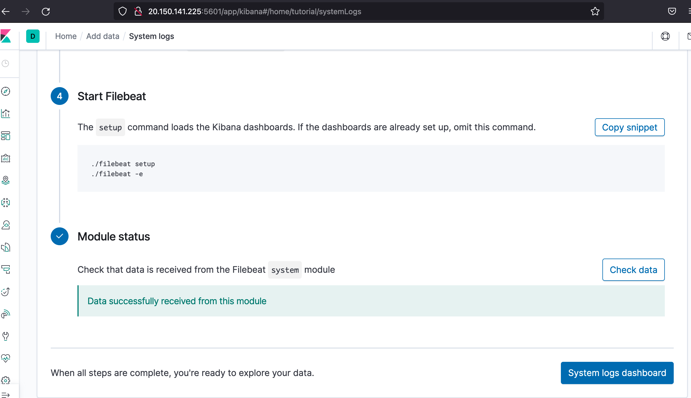

## Automated ELK Stack Deployment

The files in this repository were used to configure the network depicted below.

- [Network Diagram:](./images/Network%20Diagram%20(1).pdf)

These files have been tested and used to generate a live ELK deployment on Azure. They can be used to either recreate the entire deployment pictured above. Alternatively, select portions of the playbook yml file may be used to install only certain pieces of it, such as Filebeat.

- [filebeat Playbook:](filebeat-playbook.yml)
- [Pentest Playbook for DVWA setup:](pentest.yml)
- [metricbeat Playbook:](metricbeat-playbook.yml)
- [ELK Playbook:](elk-playbook.yml.yml)

This document contains the following details:
- Description of the Topology
- Access Policies
- ELK Configuration
  - Beats in Use
  - Machines Being Monitored
- How to Use the Ansible Build

### Description of the Topology

The main purpose of this network is to expose a load-balanced and monitored instance of DVWA, the Damn Vulnerable Web Application.

Load balancing ensures that the application will be highly available and reliable, in addition to restricting access to the network.  It also helps protect production servers by redirecting traffic in case of DDOS attacks.  
Administrative Access to these load balanced virtual machines is provided through the Jump Box Provisioner.  Using the Jump Box Provisioner provides the advantage of Network Segmentation and Access Control as well as central launching point for any administrative tasks needed on the network servers.

Integrating an ELK server allows users to easily monitor the vulnerable VMs for changes to the data and system logs.

- Much of this monitoring is simplified by utilizing a software called [Filebeat](https://www.elastic.co/guide/en/beats/filebeat/current/filebeat-overview.html)
  - Filebeat does much of the heavy lifting when it comes to retrieving the log data needed.  It's configured to search for logs in locations you specified and then forwards any found logs to the harvester where all the logs are aggreated.

- Another software that also helps collect metric data from the system and services running on the servers is called [Metricbeat](https://www.elastic.co/guide/en/beats/metricbeat/current/metricbeat-overview.html)
  - Metricbeat functionality is very similar to that of filebeat, but its focus is what's running within the server.
  - Services that Metricbeat may include Apache, MySQL or MongoDB to name a few.  
    - [Here's the complete list of modules Metricbeat supports](https://www.elastic.co/guide/en/beats/metricbeat/current/metricbeat-overview.html)

The configuration details of each machine may be found below.

| Name                 | Function       | IP Address | External IP   | Operating System     |
|----------------------|----------------|------------|---------------|----------------------|
| Jump Box Provisioner | Gateway        | 10.0.0.4   | 52.183.59.195 | Linux (ubuntu 20.04) |
| Web-1                | Web Server     | 10.0.0.5   |      None     | Linux (ubuntu 20.04) |
| Web-2                | Web Server     | 10.0.0.6   |      None     | Linux (ubuntu 20.04) |
| Elk-Server           | Server Monitor | 10.1.0.5   | 20.150.141.225| Linux (ubuntu 20.04) |

  
Prepare Virtual machines and related Azure objects

  
  ## CreateVMS
  1. [The Virtual Machines can be provisioned in the same manner. ](./images/CreateVM)
  2. [Once the VMs are provisioned the Load Balancer can be created. ](./images/CreateLoadBalancer.PNG)
  3. [Once the Load Balancer is created add Web-1 and Web-2 to a newly created Backend pool. ](./images/BackEndPool.PNG)
  4. [A load balancing rules is then created to manage the flow of traffic. ](./images/LoadBalanceRule.PNG)
  5. In order to get the machines to be able to communicate with each other add an SSH key to all your VMs
     * To generate the SSH Key run your can run the commands below or if you have one load that key:
       - ~/.ssh# ssh-keygen
       - ~/.ssh# cat id_rsa.pub
     * Once you have that key, go to each VM and select [Reset Password.](./images/ResetVMPassword.PNG)
       - Mode : Reset SSH Public Key
       - Username: Whatever username you setup the VMs with.
       - SSH public key: Copied key from generated code or old key you already had.

  
 Prepare Jump Box Provisioner

  
  ## Jump box configuration
  1. Switch to root by running:
     - sudo su
  2. Intall docker.io on the VM by running:
     - apt update
     - apt install docker.io
  3. Check to make sure sevice is running by entering:
     - systemctl status docker
  4. Once installed run:
     - docker pull cybersecurity/ansible
  5. If everything went well run:
     - docker run -ti cybersecurity/ansible:latest bash
       - This will start the container
     - run exit to quit the containter and go back to the Jump box.
  6. Modify the host file on the ansile container to include a reference to the Web Servers and to the Elk Server. 
  7. Next you install the necessary software by loading [ansible docker container](pentest.yml) into the Web servers via the Jump Box Provisioner.
  8. To test and see if everything worked out go to the IP address for the load balancer's setup.php page.  My page looks url is: [http://13.66.162.18/setup.php](./images/DVWATest.PNG), yours will be different.

  
 Preparing Ansible box configuration

  
  ## Configure Ansible Container
  1. Log into your Jump box and list your docker containers by running:
     - sudo docker container list -a 
  2. Use the list results to retrieve the name of the container you want to start.
     - run docker start [container name] 
     - then run docker attach [container name] to get a shell in the container.
  3. Locate your ansible config file and hosts file.  
     - It will most likely be within the /etc/ansible/ folder
     - Modify the ansible.cfg file. 
     - Modify the host file on the ansile container to include a reference to the Web Servers and to the Elk Server. 
  4. create a file within /etc/ansible/ called pentest-playbook.yml. 
     - run nano pentest-playbook.yml.
     - Copy the contents from [pentest-playbook.yml](pentest-playbook.yml)
     - Save the file changes and exit
  5. Next run the pentest-playbook.yml playbook in the ansible container by running.
     - ansible-playbook pentest-playbook.yml
  6. To test and see if everything worked out go to the IP address for the load balancer's setup.php page.  My page looks url is: , yours will be different.

### Access Policies

The machines on the internal network are not exposed to the public Internet. 

  
Only the Elk Server machine can accept connections from the Internet. Access to this machine is only allowed from whatever IP addresses were white listed in the load balancer's inbound rule:

    
  ## Creating Outbound rule on Elk Server
  1. Locate you IP address on https://whatismyipaddress.com
  2. [Once your IP address is located create an inbound rule allowing SSH access to your machine.](./images/InboundRuleElkServer.PNG)

    
    
Machines within the network can only be accessed by whatever IP address was setup witthin the outbound rule on the load balancer.

A summary of the access policies in place can be found in the table below.

| Name                 | Publicly Accessible | Allowed IP Addresses                 |
|----------------------|---------------------|--------------------------------------|
| Jump Box Provisioner | No                  | IP setup on Inbound Rule             |
| Web-1                | No                  | 10.0.0.4 on ssh 22                   |
| Web-2                | No                  | 10.0.0.4 on ssh 22                   |
| ELK Server           | No                  | IP Setup in Outbound rule on TCP 5601|
| Load Balancer        | No                  | IP Setup in Outbound rule on HTTP 80 |

### Elk Configuration  

Ansible was used to automate configuration of the ELK machine. No configuration was performed manually, which is advantageous because it make sure that every configuration is the same on all servers.  It also allows for deployment of applications and services quickly and simply.  With the creation of a playbook and implementation of it, a system could be up an running as quickly as the playbook is completed.

  
 before running the filebeat playbook, we first have to download and configure the elk-docker container on the ELK Server.

  
  ## Prepare [Elk Playbook: ](elk-playbook.yml)
  - Make sure machine has enought memory
  - Install docker.io
  - Install python pip
  - Install Elk (community.docker.docker_container) and set publish ports
  - Finally enable docker service at reboot.

  

  
The playbook implements the following tasks:

  
  ## Ansible [filebeat Playbook: ](filebeat-playbook.yml)
  - First the the machine memory is increated to make sure there is enough memory to run the services ansible will install
  - Then the filebeat .deb file is downloaded and installed.
  - Once installed, it is setup and started.
  - Finally it is setup to start at reboot.

Playbook can be run by entering:
- ansible-playbook filebeat-playbook.yml

The following screenshot displays the result of running `docker ps` after successfully configuring the ELK instance.

### Target Machines & Beats
This ELK server is configured to monitor the following machines:
- Web-1 : 10.0.0.5
- Web-2 : 10.0.0.6

We have installed the filebeats on ELK Server, Web-1 and Web-2

These Beats allow us to collect the following information from each machine:
- filebeat will allow for the collection of log data on the machines running in the network created.  Sample logs that filebeat can collect include system, audit logs.  It's all a matter of defining what types of logs you want filebeat to collect and configure the collection.

### Using the Playbook
In order to use the playbook, you will need to have an Ansible control node already configured. Assuming you have such a control node provisioned: 

SSH into the control node and follow the steps below:
For ELK installation:
- Copy the [elk-playbook.yml](elk-playbook.yml) file to /etc/ansible/ on the container.
- run ansible-playbook elk-playbook.yml

For filebeat installation
- Make sure the filebeat.config.yml file has the correct host referenced.  It should be the private IP address of the Elk Server.
- Run the [filebeat-playbook](filebeat-playbook.yml) with (run ansible-playbook.yml) 
- SSH into the ELK VM from the Jump box to check that the installation worked as expected.
- Once that playbook is run as well as the filebeat-playbook.yml, you can verify by going to Kibana > Logs : Add log data > System logs > 5:Module Status > Check.  Within this page you will see the data you pulled from the servers was pulled by the ELK Server.  

